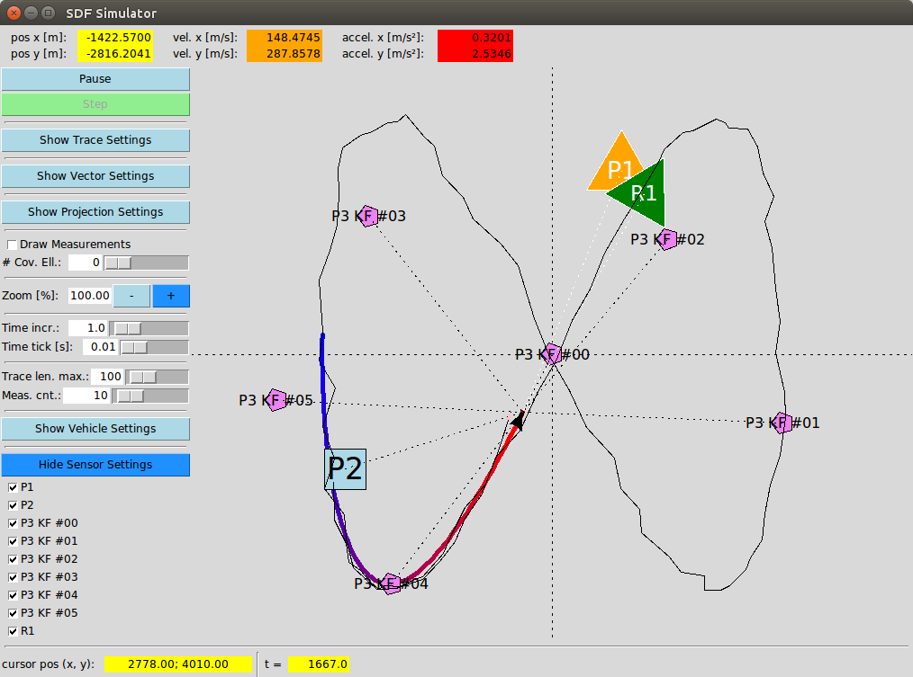
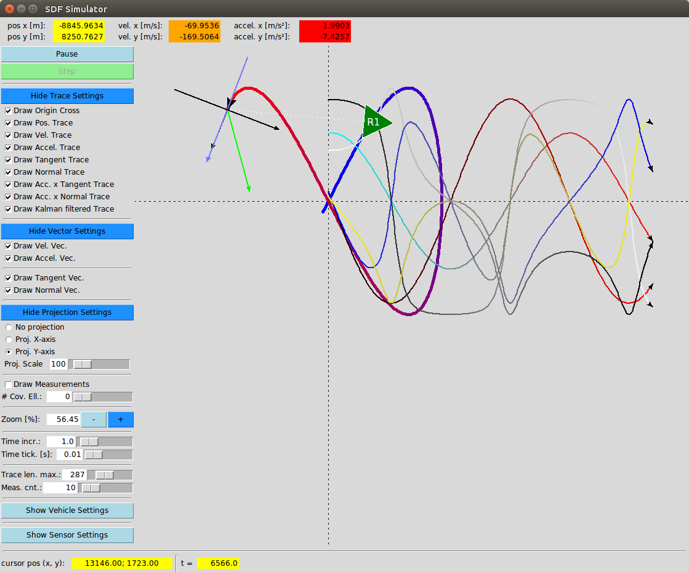

# SDF Simulator
A simulator that calculates and visualizes vehicles, sensors and kalman filtered measurements.

## Install
### Create a conda environment
```bash
conda init bash # => Open new terminal
conda create --name sdf_simulator python=3.7
conda install --name sdf_simulator numpy
conda install --name sdf_simulator tk
```

### Activate the conda environment and start the program
```bash
cd sdf_simulator/
conda activate sdf_simulator
./sdf_simulator.py
```

## Here are some screenshots on what is possible




## How to use the program
First of all, the main program sdf_simulator.py can be altered to change or create a vehicle-sensor-setup.


### Events on the drawing canvas
* **Mouse-Wheel-Up**: Zoom in based on the mouse cursor position as zoom origin.
* **Mouse-Wheel-Down**: Zoom out based on the mouse cursor position as zoom origin.
* **Shift+Left-Click+Mouse-Move**: Translates the origin of the drawing area.
* **Shift+Arrow-Left**: Move the origin a certain amount to the left.
* **Shift+Arrow-Right**: Move the origin a certain amount to the right.
* **Shift+Arrow-Up**: Move the origin a certain amount to the top.
* **Shift+Arrow-Down**: Move the origin a certain amount to the bottom. 
* **Right-Click**: A context menu appears. As for now it has one entry:
  * **Reset Transformation**: Resets the zoom and translation to the basic values.

### Events on the widgets on the settings area at the left.
* **Pause / Play**: Toggles between automatically running the simulation and pausing it. **Shift-Left-Click**: Enters the console command mode. In this mode certain command can be entered. Only "q" to quit the program is implemented as for now.
* **Step**: When in pause mode, the simulation can be stepped. Each clock on this button performs one more step in time.
* **Show Trace Settings** / **Hide Trace Settings**: Toggles the trace control area.
  * **Draw Origin Cross**: Toggles the drawing of the origin cross.
  * **Draw Pos. Trace**: Toggles the drawing of the position trace.
  * **Draw Vel. Trace**: Toggles the drawing of the velocity trace.
  * **Draw Accel. Trace**: Toggles the drawing of the acceleration trace. 
  * **Draw Tangent Trace**: Toggles the drawing of the tangent trace.
  * **Draw Normal Trace**: Toggles the drawing of the normal trace. 
  * **Draw Acc. x Tangent Trace**: Toggles the drawing of the acceleration times tangent trace.
  * **Draw Acc. x Normal Trace**: Toggles the drawing of the acceleration times normal trace.
  * **Draw Kalman filtered Trace**: Toggles the drawing of the Kalman filtered trace.
* **Show Vector Settings** / **Hide Vector Settings**: Toggles the vector control area.
  * **Draw Vel. Vec.**: Toggles the drawing of the velocity vector.
  * **Draw Accel. Vec.**: Toggles the drawing of the acceleration vector.
  * **Draw Tangent Vec.**: Toggles the drawing of the tangent vector.
  * **Draw Normal Vec.**: Toggles the drawing of the normal vector.
* **Show Projection Settings** / **Hide Projection Settings**: Toggles the projection control area.
  * **No projection**: Disables the projection of the trace (normal visualization).
  * **Proj. X-axis**: Enables the projection of the trace onto the X-axis.
  * **Proj. Y-axis**: Enables the projection of the trace onto the Y-axis.
  * **Proj. Scale**: Scaling factor of the projected traces.
* **Draw Measurements**: Toggles the drawing of the measurements.
* **\# Cov. Ell.**: Sets the number of covariance ellipses. A value 0 zero disables them.
* **Zoom [%]**: Sets the zoom factor of the whole visualization.
* **Time incr.**: Sets the simulation time increase per simulation step.
* **Time tick [s]**: Sets the number of steps (ticks) per second. Limited by the max. simulation speed due to processing power. The more elements are shown the slower it gets.
* **Trace len. max.**: Sets the max. length [steps] of the traces.
* **Meas cnt.**: Sets the max. number of measurements in the measurement buffer. Increasing the buffer size can make sense if changing the trace length, since the trace can only be as long as data in the buffer.
* **Show Vehicle Settings** / **Hide Vehicle Settings**: Toggles the vehicle control area.
  * **Vehicle A**: Toggles the activity of the first defined vehicle.
  * **Vehicle ...**: Toggles the activity of the second one ...
* **Show Sensor Settings** / **Hide Sensor Settings**: Toggles the sensor control area.
  * **Sensor A**: Toggles the activity of the first defined sensor.
  * **Sensor ...**: Toggles the activity of the second one ...

## Nomenclature
* r = position
* rd (r') = velocity
* rdd (r'') = acceleration